<!--GUI / Deployment instruction / wiki-->
# FOOD DIARY STEP-BY-STEP MANUAL 📜

This is a Step-by-step user manual that teaches how to use Food Diary app. In Food Diary you can keep log what you have eaten and when.
From the input page you can add new meals you have enjoyd on your breakfast, lunch or Dinner. Then the Food Diary has pages for breakfast, lunch and dinner
where you can see your inputted meals, edit them or delete them all. Food Diary also has authentication so unlitimed amount of users can have their own Diary in single device.
Authentication also remembers users so if you don't log out, you will still be logged in even if the device is shut down in between.
Food Diary is coded with HTML/CSS in the frontend. The backed uses php and sql commands. There is also a file in the github that creates the fooddiary_db database if you would like to test this app locally.

 

Here is an online link to Food Diary App: http://konstanenonenlaurea.azurewebsites.net/index.php

 
 
   
# AUTHENTICATION 🔐

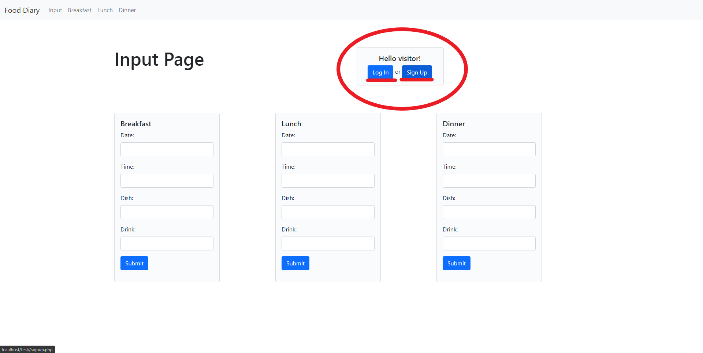

From rigth top corner you can Sing Up or Log In.

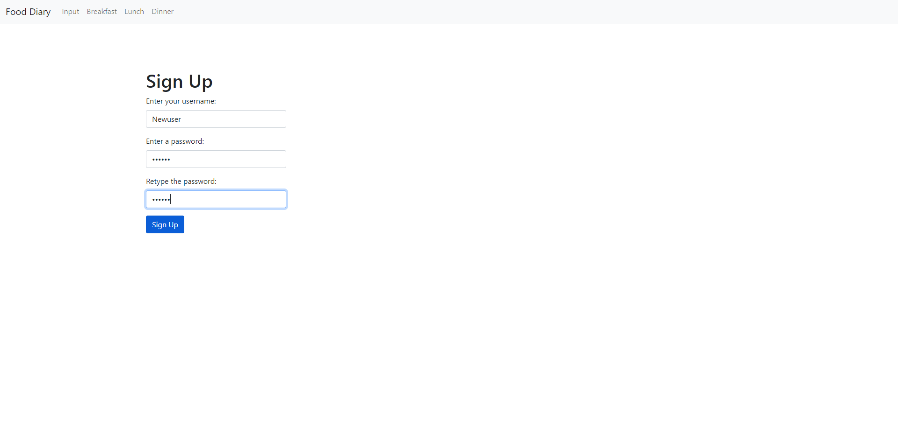

From Sing Up Page you can create a new user. Select a new username and enter the same password twice.

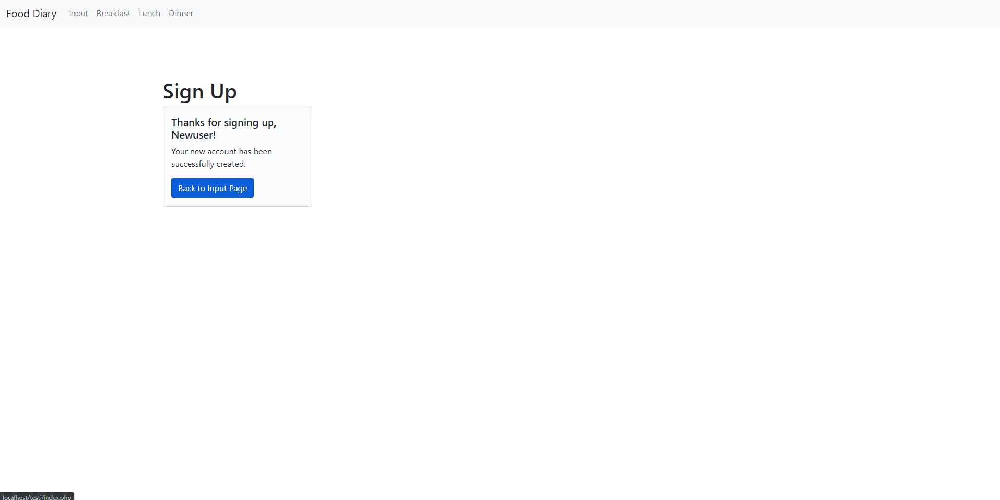

After you gave signed up. This confirmation message will show to you.

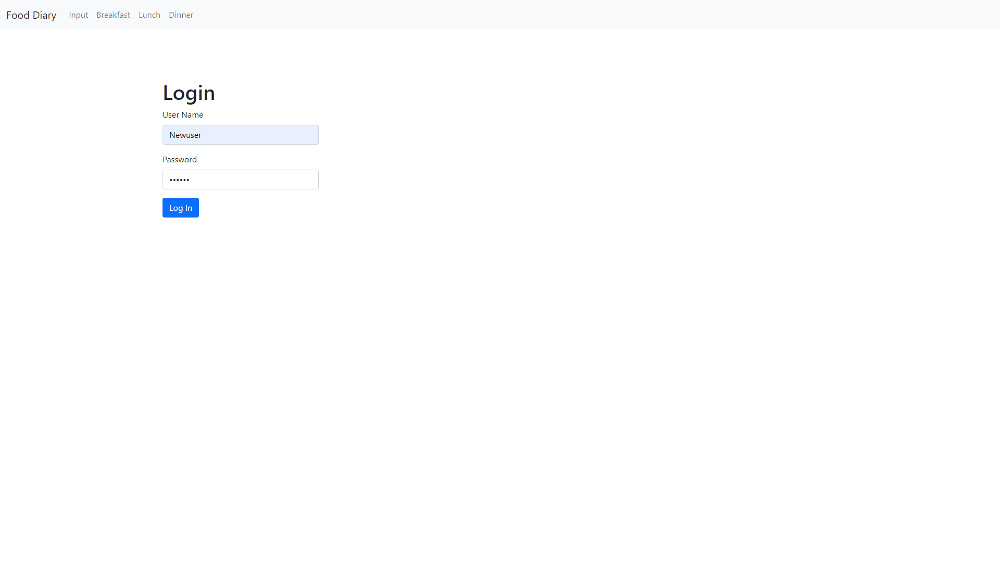

If you are an old user, you can just login. 

 
 

# INPUT PAGE ✏️

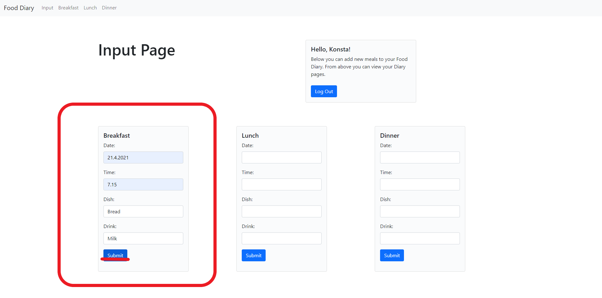

In input page you can add new meals to your Food Diary. In this example we add a new meal to Breakfast Page.

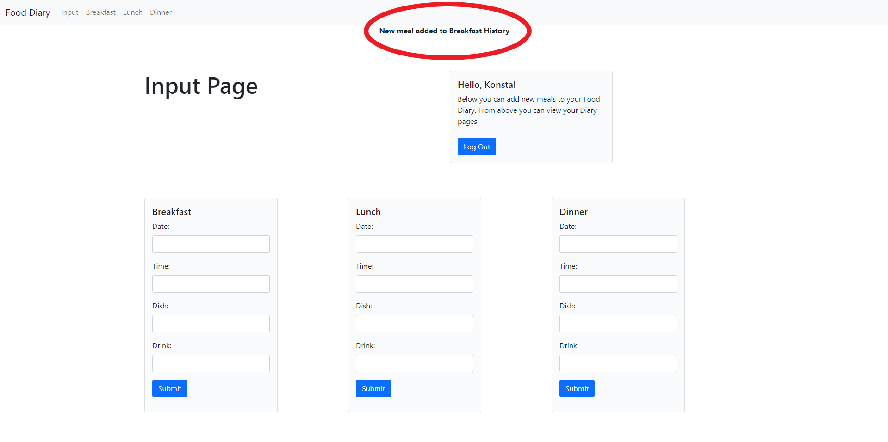

After you submit the new meal you see the confirmation message on top of the page.

 
 

# EXAMPLE BREAKFAST PAGE 🥓🍳🥛

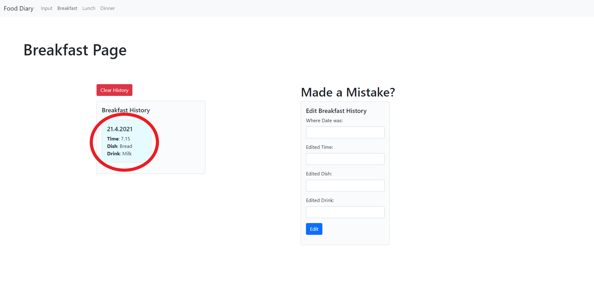

This is how all yout meal pages look like. Here you can see our newly added meal in the Breakfast History.

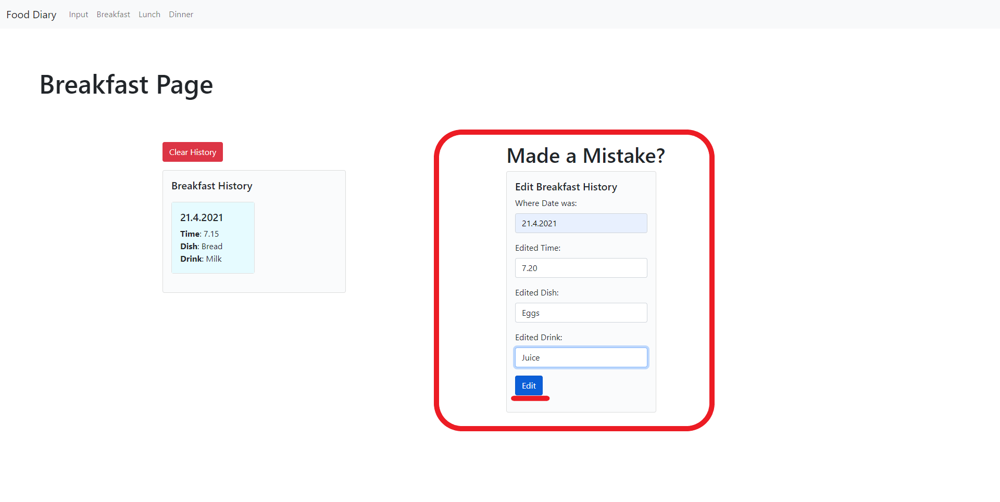

You can edit your meals in the Breakfast History using this editing form. Enter what meal you want to edit by typing it's date on top of the form. After that you cant edit the time, dish and drink information below.

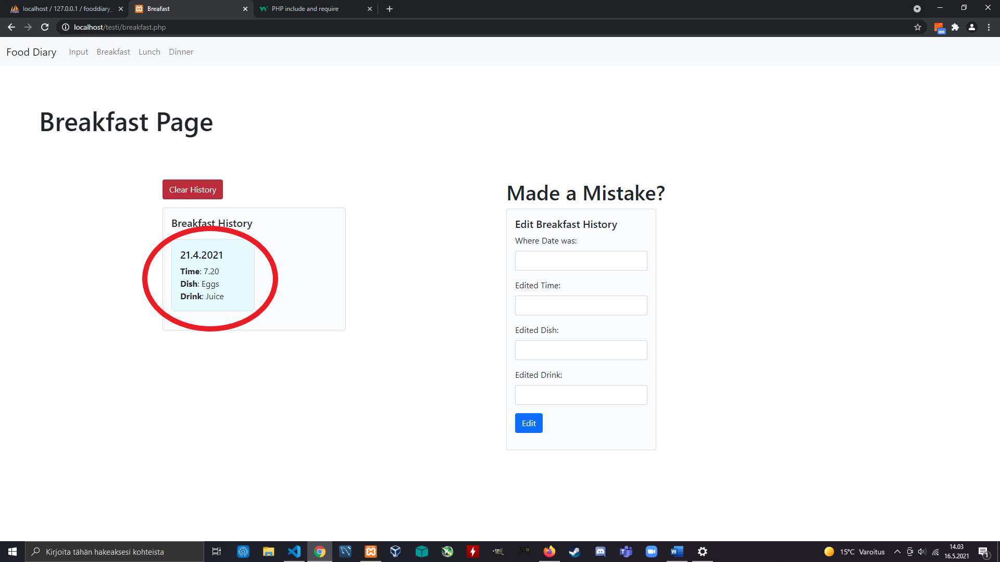

Here you can see the edited meal in Breakfast History.

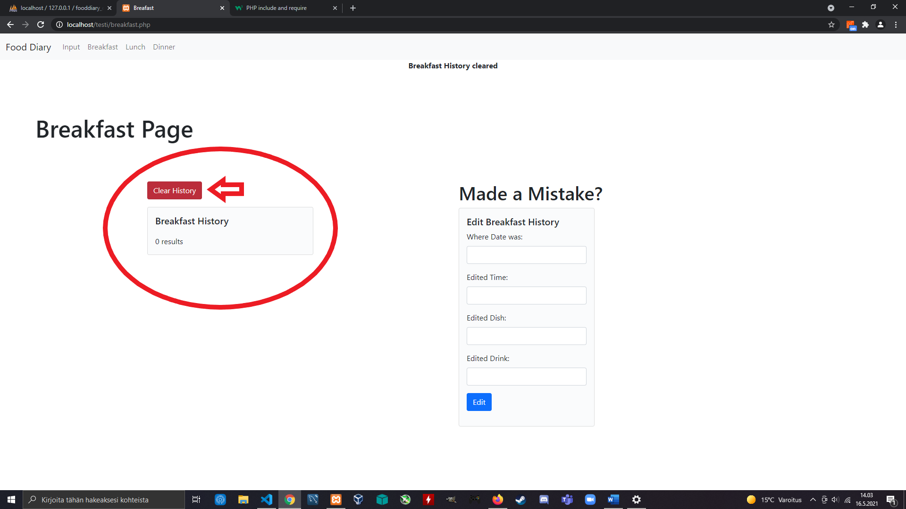

Clicking the "Clear History" button will delete all meals from Meal History.

 
 

#DATABASE IMAGE

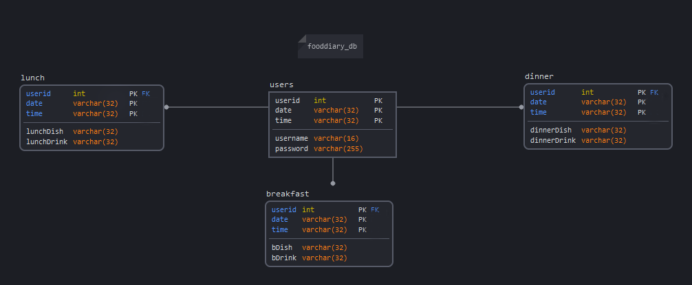
